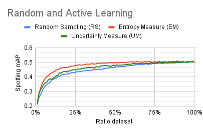
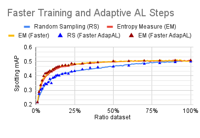
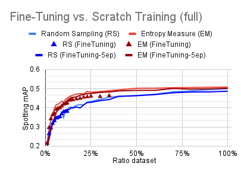

# Towards Active Learning for Action Spotting in Association Football Videos

This repository contains the code of the paper: [Towards Active Learning for Action Spotting in Association Football Videos](https://arxiv.org/pdf/2304.04220.pdf) published at the CVSports workshop at CVPR 2023.

## Experiments with NetVLAD++

In this section, we detail the experiments performed on NetVLAD++.

### Anaconda environment

```
conda create -y -n ActiveSpotting python=3.8
conda activate ActiveSpotting
conda install -y pytorch=1.6 torchvision=0.7 cudatoolkit=10.1 -c pytorch
pip install SoccerNet matplotlib scikit-learn
```

### Download Dataset

NetVLAD++ is trained on top of pre-extracted video features.
For this paper, we investigated the genericly pre-trained ResNET features reduced with PCA to a dimension of 512.
For better action spotting performances, you can replace the `*_ResNET_TF2_PCA512.npy` features with the `*_baidu_soccer_embeddings.npy` features.

```python
import SoccerNet
from SoccerNet.Downloader import SoccerNetDownloader as SND
mySND=SND(LocalDirectory="path/to/SoccerNet")
mySND.downloadGames(files=["1_ResNET_TF2_PCA512.npy", "2_ResNET_TF2_PCA512.npy"], split=["train","valid","test"])
```

Tip: if you do not have enough storage, you can create a symbolic link from a remote folder to `path/to/SoccerNet`.

```bash
mkdir -p path/to
ln -s /media/giancos/Football/SoccerNet_ActiveLearning  -T path/to/SoccerNet
```

### First Results

The following code trains a model iteratively with an increasing number of sample, selected randomly, or actively (confidence-based and entropy-based).

```bash
# Train with  a random active sampler
python src/main.py --SoccerNet_path="path/to/SoccerNet/"  --sampling_method=random --model_name=SoccerNet_Random

# Train with  an active sampler based on confidence scores
python src/main.py --SoccerNet_path="path/to/SoccerNet/"  --sampling_method=confidence_0.5 --model_name=SoccerNet_Confidence_0.5

# Train with  an active sampler based on entropy scores
python src/main.py --SoccerNet_path="path/to/SoccerNet/"  --sampling_method=entropy --model_name=SoccerNet_Entropy
```

This code list the performances of the training per active learning iteration.

```bash
# List performance per active learning iteration for the Random sampling
tail -n100000  models/SoccerNet_Random/*.log | grep "a_mAP visibility all:"

# List performance per active learning iteration for the Confidence-based active sampling
tail -n100000  models/SoccerNet_Confidence_0.5/*.log | grep "a_mAP visibility all:"

# List performance per active learning iteration for the Entropy-based active sampling
tail -n100000  models/SoccerNet_Entropy/*.log | grep "a_mAP visibility all:"
```

This graph summarize the performances per ratio of trainig dataset.



### Faster Train ing and Active Learning Steps

You can train faster with an optimize training profile and increase the samples in the active learning step faster.

```bash
# Train with a random active sampler
python src/main.py --SoccerNet_path="path/to/SoccerNet/"  --sampling_method=random --training_scheme faster --active_scheme increasing  --model_name=SoccerNet_Random_faster_incr --GPU 0

# Train with an active sampler based on confidence scores
python src/main.py --SoccerNet_path="path/to/SoccerNet/"  --sampling_method=confidence_0.5 --training_scheme faster --active_scheme increasing  --model_name=SoccerNet_Confidence_0.5_faster_incr --GPU 0

# Train with an active sampler based on entropy scores
python src/main.py --SoccerNet_path="path/to/SoccerNet/"  --sampling_method=entropy --training_scheme faster --active_scheme increasing  --model_name=SoccerNet_Entropy_faster_incr --GPU 0
```

This code list the performances of the training per active learning iteration.

```bash
# List performance per active learning iteration for the Random sampling
tail -n100000  models/SoccerNet_Random_faster_incr/*.log | grep "a_mAP visibility all:"

# List performance per active learning iteration for the Confidence-based active sampling
tail -n100000  models/SoccerNet_Confidence_0.5_faster_incr/*.log | grep "a_mAP visibility all:"

# List performance per active learning iteration for the Entropy-based active sampling
tail -n100000  models/SoccerNet_Entropy_faster_incr/*.log | grep "a_mAP visibility all:"
```

This graph summarize the performances per ratio of training dataset using faster training and increasing active learning steps.



### Finetuning models

You can fine-tune the model for a few epochs at each active learning iteration to reach faster performances.

```bash
# Fine-tune with a random active sampler
python src/main.py --SoccerNet_path="path/to/SoccerNet/"  --sampling_method=random --training_scheme faster --active_scheme increasing --continue_training --model_name=SoccerNet_Random_faster_incr_cont

# Fine-tune with an active sampler based on entropy scores
python src/main.py --SoccerNet_path="path/to/SoccerNet/"  --sampling_method=entropy --training_scheme faster --active_scheme increasing --continue_training --model_name=SoccerNet_Entropy_faster_incr_cont

# Fine-tune with a random active sampler for 5 epochs only
python src/main.py --SoccerNet_path="path/to/SoccerNet/"  --sampling_method=random --training_scheme faster --active_scheme increasing --continue_training --max_epochs 5 --model_name=SoccerNet_Random_faster_incr_cont_5

# Fine-tune with an active sampler based on entropy scores for 5 epochs only
python src/main.py --SoccerNet_path="path/to/SoccerNet/"  --sampling_method=entropy --training_scheme faster --active_scheme increasing --continue_training --max_epochs 5 --model_name=SoccerNet_Entropy_faster_incr_cont_5
```

This code list the performances of the continual training per active learning iteration.

```bash
# List performance per active learning iteration for the Random sampling
tail -n100000  models/SoccerNet_Random_faster_incr_cont/*.log | grep "a_mAP visibility all:"

# List performance per active learning iteration for the Entropy-based active sampling
tail -n100000  models/SoccerNet_Entropy_faster_incr_cont/*.log | grep "a_mAP visibility all:"

# List performance per active learning iteration for the Random sampling for 5 epochs training only
tail -n100000  models/SoccerNet_Random_faster_incr_cont_5/*.log | grep "a_mAP visibility all:"

# List performance per active learning iteration for the Entropy-based active sampling for 5 epochs training only
tail -n100000  models/SoccerNet_Entropy_faster_incr_cont_5/*.log | grep "a_mAP visibility all:"
```

This graph summarize the performances per ratio of training dataset by fine-tuning to model at each iteration step.



## Experiments with PTS

In this section, we detail the experiments performed on PTS

### Anaconda environment

TBD

### Experiments

TBD

### Main Results

TBD
